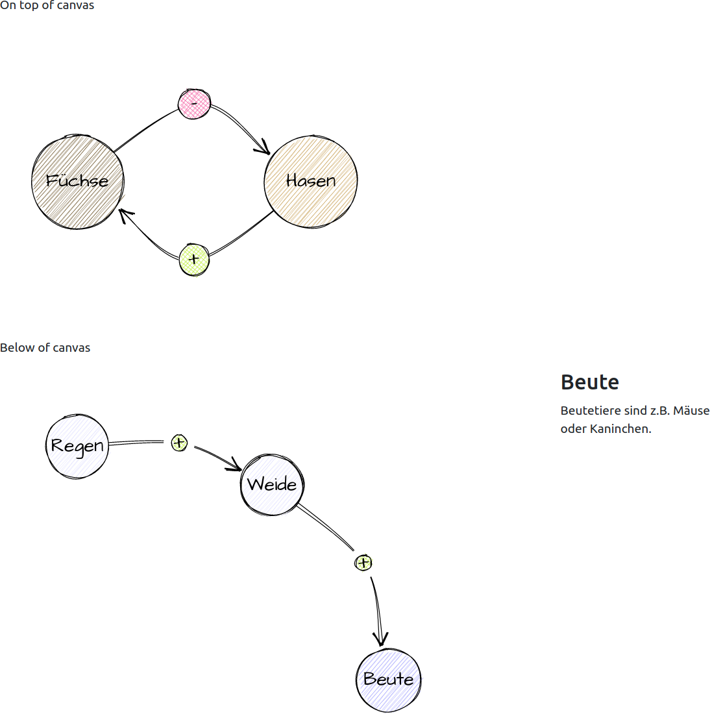

# Causal Loop Diagram with roughjs

rough_cld

You can draw causal loop diagrams (CLD). This library uses roughjs for handdrawn circles and connections. You can draw multiple
diagrams on one page. Rough_cld is based on Bootstrap (>= 5.2).

* You can show the diagram completely expanded. For every node and edge you can add some informations, which are displayed as popovers.
* Or you can show the diagram stepwise. In this case informations to each node or edge are shown beside the diagram. If you want you can go backward.

You can try this [demo](https://assets.eloqueasy.de/rough_cld/).

# Use

The head of your HTML page should look like this:

    <head>
      <title>SVG Test</title>
      <meta charset="utf-8">

      <link href="https://fonts.eloqueasy.de/font-architects-daughter.css" rel="stylesheet">
      <link rel="stylesheet" href="https://assets.eloqueasy.de/bootstrap-5/dist/css/bootstrap.min.css">
      <link href="https://assets.eloqueasy.de/fontawesome-free/css/all.min.css" rel="stylesheet"/>
      
      
      
      
      
    </head>

First you have to declare a canvas and info area. The names must be unique on this page (*svg_456*), and the info div has to be named in the following way: <name of the svg canvas>_info (*svg_456_info*):

    

        

            <svg id="svg_456" width="600px" height="400px" viewbox="100 200 600 400"></svg>
        

        

            

        

    

Next you have to include the data:

    

With
  
    var rcld_456 = new RoughCld("svg_456")

you have to use the name of your canvas div (*svg_456*). If you want to draw more then one causal loop on one page you have to declare an unique name for each class instance (*rcld_456*).
  
Nodes have the following structure:
  
  - First item is an id.
  - Second you describe the x position.
  - Then you declare the y position.
  - Every node can have a different color.
  - Next you describe the URL for more informations for this node. Normally you fill in "#".
  - Then you declare the title of your popver dialog.
  - Last you write the additional infos for this node.
  
Edges have a similar structure:
  
  - First item is an id from which node the connection is starting.
  - Second id describes the target of your connection.
  - With the *bend* parameter you tell the connector how much it is curved. With "+" and "-" you can change the side of the curved connection (100 vs -100).
  - "1" means strengthening influence (+); -"1" means weakening influence. If you want a bolder curve use "2" or "-2".
  - Next you describe the URL for more informations for this edge. Normally you fill in "#".
  - Then you declare the title of your popver dialog.
  - Last you write the additional infos for this node.

If you want to show the complete diagram (*true*), you call
  
    rcld_456.draw_cld(nodes, edges, true)

If you want to show the diagram stepwise you have to create control buttons. Since index.html has two diagrams on the same page, I had to declare a second class (*rcld_123*):
  
    

        

            <button class="btn btn-light" onclick="rcld_123.prev_edge()"><i class="fas fa-chevron-circle-left"></i></button>
            <button class="btn btn-light" onclick="rcld_123.next_edge()"><i class="fas fa-chevron-circle-right"></i></button>
        

    
  
  
The last step is calling draw_cld with the complete parameter set to *false*:
  
    rcld_123.draw_cld(nodes, edges, false)
  

# Python

You can generate the nodes and edges by an additional Python program: *python generate_cld.py* . The model has to be described in the following way:

    R = 60
    causal_raw = """
    Regen (1;1;#;Der Regen ist die Basis allen Lebens)
    Weide (3;2;#;Nahrungsgrundlage für viele Beutetiere)
    Beute (4;4;#;Nahrungsgrundlage für viele Jäger)
    Jäger (1;4;#;Spitze der Nahrungspyramide;#a00000)
    Regen +> Weide (2;#;Der Regen fördert das Wachstum der Pflanzen)
    Weide +> Beute (2;#;Eine üppige Wiese kann viele Beutetiere ernähren)
    Beute ++> Jäger (6;#;Viele Beutetiere sind eine gute Nahrungsgrundlage für Jäger)
    Jäger --> Beute (6;#;Jäger hält die Anazhl der Beutetiere im Gleichgewicht)
    """

* The coordinates are calculated depending on *R*.
* You don't have to use apostrophes for strings.
* The *strength* is expressed by *++>* or *-->*. You shuoldn't use more then 3 plus or minus signs.

# See also

* [Roughjs](https://roughjs.com/)
* [Loopy](https://ncase.me/loopy/)
* [Fork of Loopy](https://github.com/schucan/loopy)
